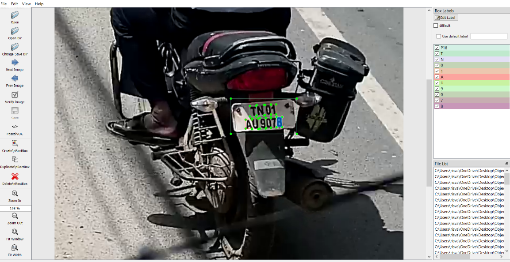
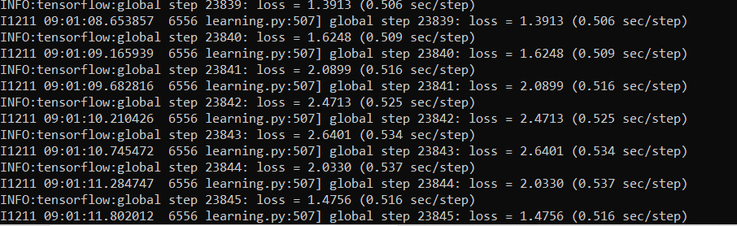
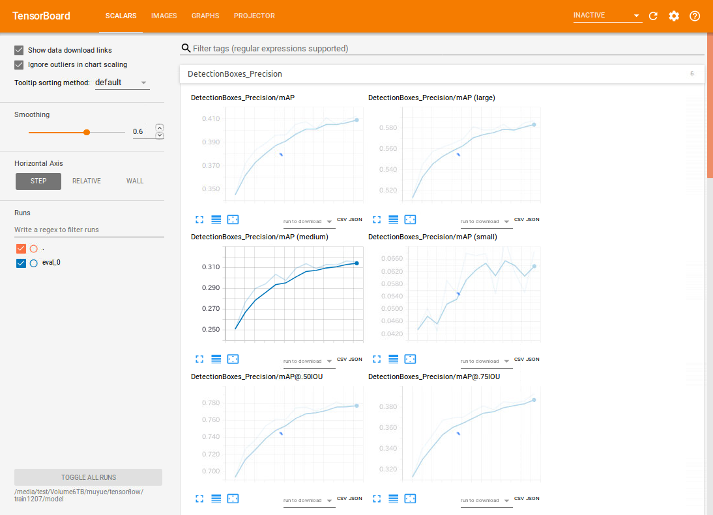
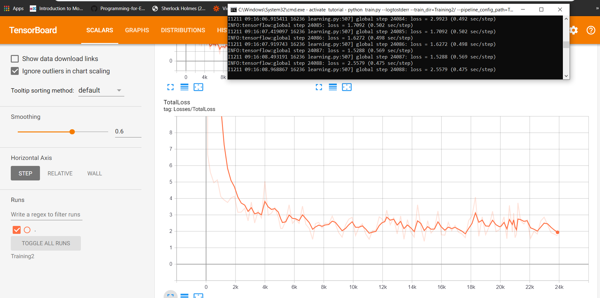
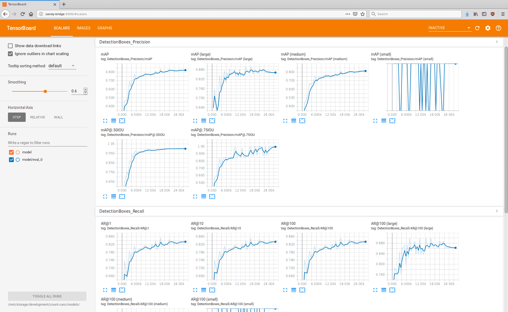
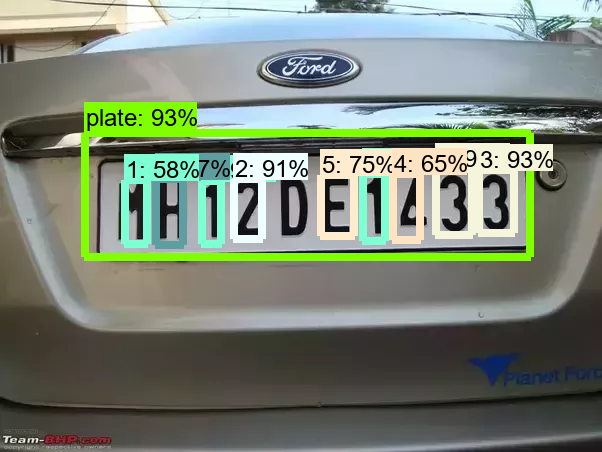

# License Plate Detector

## Overview
Automatic License Plate Recognition (ALPR) is an essential tool for identifying vehicles, which has applications in areas like parking, border control, and highway tolling. This project aims to create a shared library file that can be used in a C/C++ application to detect license plates in images or videos and store the number.

## Installation and Setup

### Requirements
- Windows/Linux platform
- TensorFlow library
- Protobuf Compiler
- Anaconda
- Bazel
- System with GPU support

### Installation
1. Install TensorFlow and necessary dependencies.
2. Set up the Python environment using Anaconda.
3. Install Bazel for building the TensorFlow shared library.

## Methodology

### Ground Truth Extraction
1. Label license plates using LabelImg.
2. Convert XML files to CSV and then to TensorFlow records.
3. Use these records for training the model.

### Training the Model
- Pretrained model: `ssd_mobilenet_v1_coco`
- Configuration includes modifying the number of classes, setting paths, etc.
- Train using `train.py` script.

### Exporting the Inference Graph
- Export the trained model to an inference graph using `export_inference_graph.py`.

### Building the Shared Library
- Use Bazel to build the TensorFlow shared library (`.so` file).

## Usage
- Import the shared library into a C++ program.
- Detect license plates in images or videos using the trained model.

## Issues and Future Work
- Challenges faced in building the TensorFlow shared library.
- Future work will focus on improving the accuracy of detection by modifying the CNN architecture.

## References
- [TensorFlow Object Detection API Tutorial](https://pythonprogramming.net/introduction-use-tensorflow-object-detection-api-tutorial/)
- [Installing Bazel](https://docs.bazel.build/versions/master/install-ubuntu.html)
- [Research Paper on CNN](https://arxiv.org/pdf/1506.02640.pdf)
